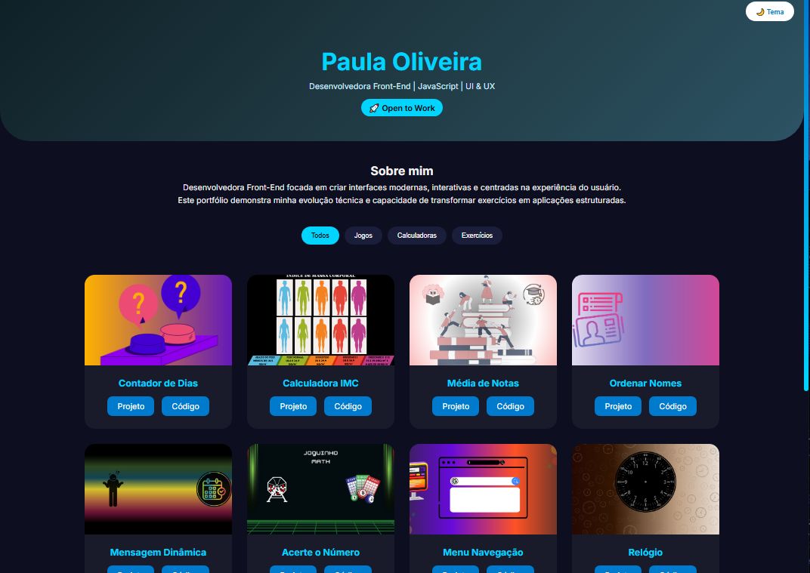

<h1 align="center">🚀 Portfólio JavaScript</h1>

<p align="center">
  <strong>Paula Oliveira • Desenvolvedora Front-End</strong><br>
  💡 Interfaces interativas • 🎨 UX • ⚡ Boas práticas
</p>

<p align="center">
  <a href="https://paulapsox.github.io/Proj-JS/">
    
  </a>
  <a href="https://github.com/paulaPSOx/Proj-JS">
    
  </a>
</p>

---

## 🧠 Sobre

Coleção de projetos em **JavaScript**, evoluindo de exercícios acadêmicos para aplicações mais estruturadas.

Foco em:

🧩 Organização e escalabilidade de código  
🎯 Interatividade e lógica aplicada  
✨ Experiência do usuário (UX)

---

## 🎯 Objetivo

Transformar soluções simples em aplicações reais  
Aplicar boas práticas de desenvolvimento front-end  
Criar interfaces modernas, responsivas e intuitivas  

---

## 🛠️ Tecnologias

<p align="center">
  
</p>

---

## 📂 Estrutura do Projeto

```
Proj-JS/
├── AVA-JS01/
├── AVA-JS02/
├── AVA-JS03/
├── AVA-JS04/
├── AVA-JS05/
├── AVA-JS06/
├── AVA-JS07/
├── AVA-JS08/
├── AVA-JS09/
├── AVA-JS10/
├── index.html
├── style.css
└── script.js
```

---

## 📌 Projetos Desenvolvidos

✨ Aplicações interativas com foco em lógica e UI:

📅 Contador de Dias  
⚖️ Calculadora IMC  
📊 Média de Notas  
🔤 Ordenar Nomes  
💬 Mensagem Dinâmica  
🎯 Acerte o Número  
📱 Menu de Navegação  
⏰ Relógio Digital  
❤️ Coração Animado  
🖼️ Galeria de Imagens  

---

## ⚙️ Funcionalidades

🔍 Filtro dinâmico de projetos  
🌙 Tema claro/escuro  
📱 Layout responsivo  
✨ Animações suaves  

---

## 📸 Preview

<p align="center">
  
</p>

---

## 📬 Contato

<p align="center">
  <a href="https://github.com/paulaPSOx">
    
  </a>
  <a href="https://www.linkedin.com/in/oliveiraspaula">
    
  </a>
</p>

---

## 🏆 Status

🚀 <strong>Projeto finalizado e pronto para apresentação profissional</strong>

---

## 🔥 Diferenciais

Código organizado por módulos  
Separação de responsabilidades (HTML, CSS, JS)  
Foco em experiência do usuário  
Projetos pensados como aplicações reais
